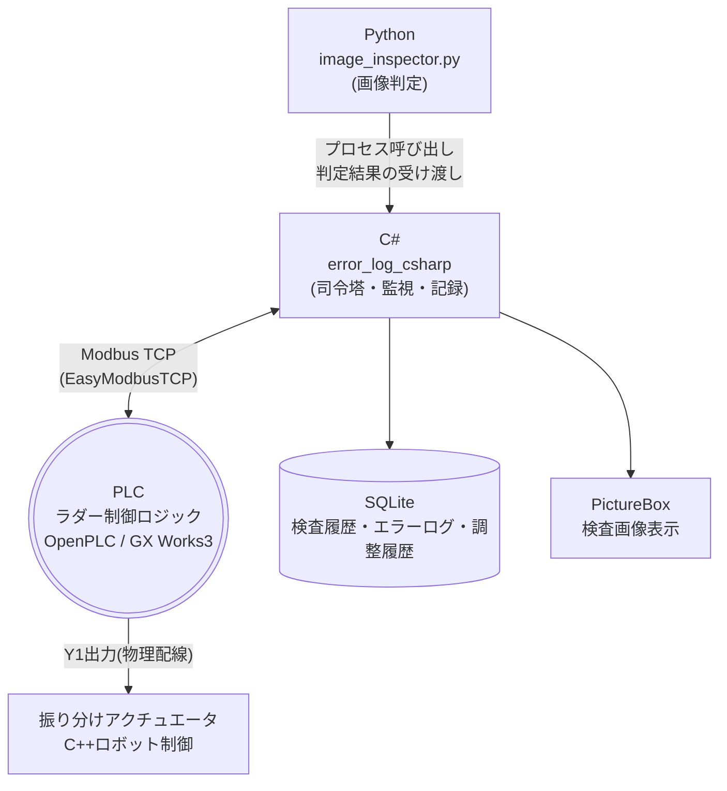
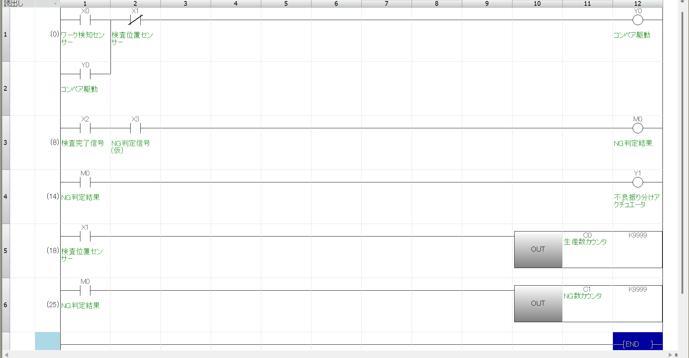
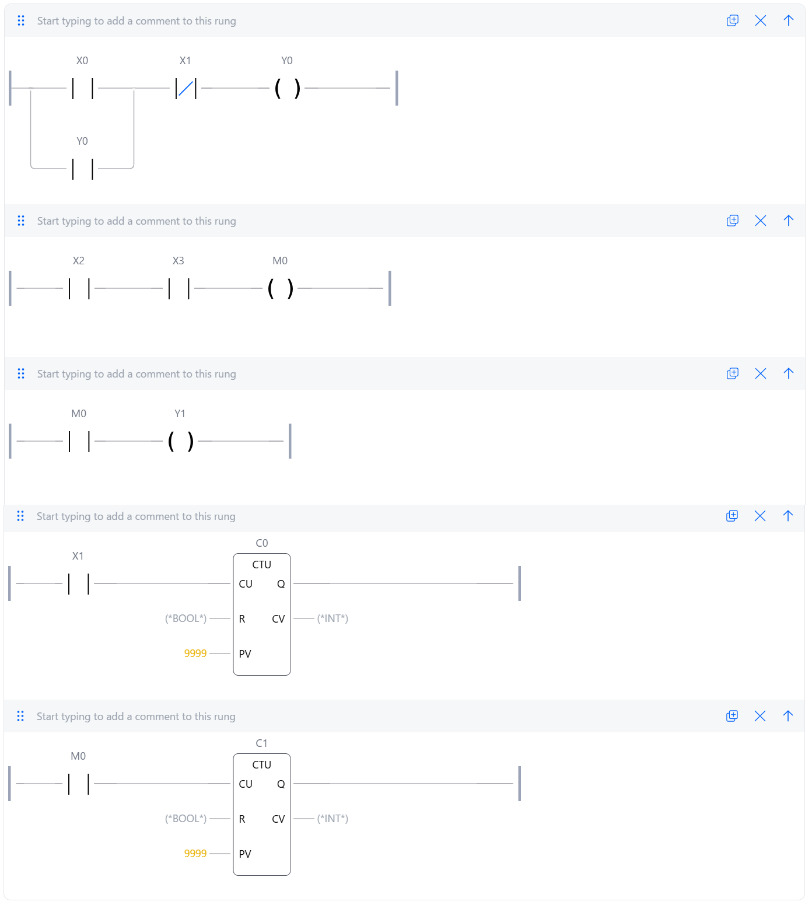

# inspection_line_plc

外観検査ラインの搬送・検査・振り分けシーケンスを想定した、PLCラダープログラムです。
三菱電機GX Works3での設計と、OpenPLCを用いた外部システム(Python/C#)との通信検証を公開。

## 目次

- [背景](#背景)
- [システム全体構成](#システム全体構成)
- [制御ロジックの設計(GX Works3)](#制御ロジックの設計gx-works3)
- [外部通信の技術検証(OpenPLC)](#外部通信の技術検証openplc)
- [今後の拡張構想](#今後の拡張構想)

---

## 背景

製造業での外観検査工程の実務経験をもとに、「センサーでワークを検知し、コンベアで搬送、検査位置で停止、判定結果に応じて振り分ける」という一連のシーケンスをPLCで再現しました。
現場で使われる三菱電機PLC(GX Works3)での設計に加え、画像判定(Python)・監視記録(C#)との連携を見据えた外部通信の実装可否まで検証しています。

---

## システム全体構成

制御ロジックの本体であるPLCを中心に、周辺システムが接続する構成です。

PLCが制御ロジックの中心にあり、C#がPLC・Python・データベース・画面表示をまとめる司令塔として機能します。

| 層 | 役割 | 技術 |
|---|---|---|
| 制御ロジック | 搬送・検知・判定・振り分けの物理制御 | PLC(ラダー図) |
| 判定処理 | 画像による欠陥検査・寸法測定 | Python + OpenCV |
| 司令塔 | PLC監視、Python呼び出し、記録、表示 | C#(WinForms) |
| データ保存 | 検査履歴・機械エラー・調整ノウハウの蓄積 | SQLite |

### 各接続の状態

| 接続 | 使用技術 | 状態 |
|---|---|---|
| Python ⇔ C# | プロセス呼び出し(標準出力/JSON) | 設計済み・実装予定 |
| C# ⇔ PLC | Modbus TCP(EasyModbusTCP) | ✅検証済み |
| Python ⇔ PLC | Modbus TCP(pymodbus) | ✅検証済み(技術検証用) |
| C# ⇔ SQLite | ADO.NET / SQLite | 実装予定 |
| PLC ⇒ アクチュエータ | 物理配線(Y1出力) | 設計完了(ハードウェア範囲外) |

---

## 制御ロジックの設計(GX Works3)

自己保持回路・判定分岐・カウンターを組み合わせた基本シーケンスです。三菱電機FX5U(iQ-Fシリーズ)を想定して設計しました。

### 回路構成

| 行 | デバイス | 内容 |
|---|---|---|
| 1〜2 | X0, X1, Y0 | ワーク検知(X0)後、検査位置到達(X1)まで自己保持でコンベア(Y0)を動作させる |
| 3 | X2, X3, M0 | 検査完了信号(X2)とNG判定信号(X3)からNG判定結果(M0)を生成 |
| 4 | M0, Y1 | NG判定結果を受けて振り分けアクチュエータ(Y1)を駆動 |
| 5 | X1, C0 | 検査位置到達のたびに生産数カウンタ(C0)をカウントアップ |
| 6 | M0, C1 | NG判定のたびにNG数カウンタ(C1)をカウントアップ |

### デバイス一覧

| デバイス | 名称 | 種別 |
|---|---|---|
| X0 | ワーク検知センサー | 入力 |
| X1 | 検査位置センサー | 入力 |
| X2 | 検査完了信号 | 入力 |
| X3 | NG判定信号(仮) | 入力 |
| Y0 | コンベア駆動 | 出力 |
| Y1 | 不良振り分けアクチュエータ | 出力 |
| M0 | NG判定結果 | 内部リレー |
| C0 | 生産数カウンタ | カウンター |
| C1 | NG数カウンタ | カウンター |

---

## 外部通信の技術検証(OpenPLC)

当初は三菱電機のGX Simulator3上でSLMP(MCプロトコル)による外部通信を試みましたが、シミュレータ環境の制約により、ループバック通信が確立できないことが判明しました(timeout / 接続拒否)。

代替として、オープンソースのソフトPLC「OpenPLC」で同一のラダーロジックを再現し、Modbus TCPによる外部通信を実際に検証しました。

---

## 今後の拡張構想

### AIによる分析支援

蓄積したエラーログ・調整履歴データをもとに、Pythonで以下のような分析機能を追加する構想です。

- エラーログのパターンから、原因・対処法を推定
- 過去の調整パラメータから、類似症状に対する最適値を提案

---

## 使用技術

- **PLC設計**: 三菱電機 GX Works3(ラダー言語、FX5U/iQ-Fシリーズ想定)
- **外部通信検証**: OpenPLC Runtime v4、Modbus TCP
- **判定処理**: Python, OpenCV, pymodbus
- **監視・記録**: C#(WinForms), EasyModbusTCP
- **データ管理**: SQLite(実装予定)

